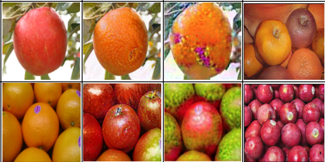

I'm currently a second-year Master student in Zhejiang University advised by professor <a href="https://person.zju.edu.cn/en/msong">MingLi Song</a>. I received my Bachelor’s degree of Computer Science in Zhejiang University in 2019. 

<h2> Research </h2>

<b>Contrastive Model Inversion for Data-Free Knowledge Distillation</b>  
<b>Gongfan Fang</b>, Jie Song, Xinchao Wang, Chengchao Shen, Xingen Wang, Mingli Song  
<I>International Joint Conferences on Artificial Intelligence Organization (IJCAI), 2021</I>

   

<b>Data-Free Adversarial Distillation</b>  
<b>Gongfan Fang</b>, Jie Song, Chengchao Shen, Xinchao Wang, Da Chen, Mingli Song  
<I>arXiv preprint arXiv:1912.11006</I>

   

<b>Impression Space from Deep Template Network</b>  
<b>Gongfan Fang</b>, Xinchao Wang, Haofei Zhang, Jie Song, Mingli Song  
<I>arXiv preprint arXiv:2007.05441</I>

 
  

<b>Knowledge amalgamation from heterogeneous networks by common feature learning</b>  
Sihui Luo, Xinchao Wang, <b>Gongfan Fang</b>, Yao Hu, Dapeng Tao, Mingli Song  
<I>International Joint Conferences on Artificial Intelligence Organization (IJCAI), 2019</I>

 
   

<b>Adversarial Self-Supervised Data-Free Distillation for Text Classification</b>  
Xinyin Ma, Yongliang Shen, <b>Gongfan Fang</b>, Chen Chen, Chenghao Jia, Weiming Lu  
<I>Empirical Methods in Natural Language Processing (EMNLP), 2020</I>

 
   

<h2> Project </h2>

<b>Pytorch-MSSSIM</b>  
Fast and differentiable MS-SSIM and SSIM for pytorch  
<I>https://github.com/VainF/pytorch-msssim</I>

 
    

<b>Torch-Pruning</b>  
A pytorch toolkit for structured neural network pruning and layer dependency maintaining  
<I>https://github.com/VainF/Torch-Pruning</I>

 
    

<b>DeepLabV3Plus-Pytorch</b>  
DeepLabv3, DeepLabv3+ and pretrained weights on VOC & Cityscapes.  
<I>https://github.com/VainF/DeepLabV3Plus-Pytorch</I>

 
    