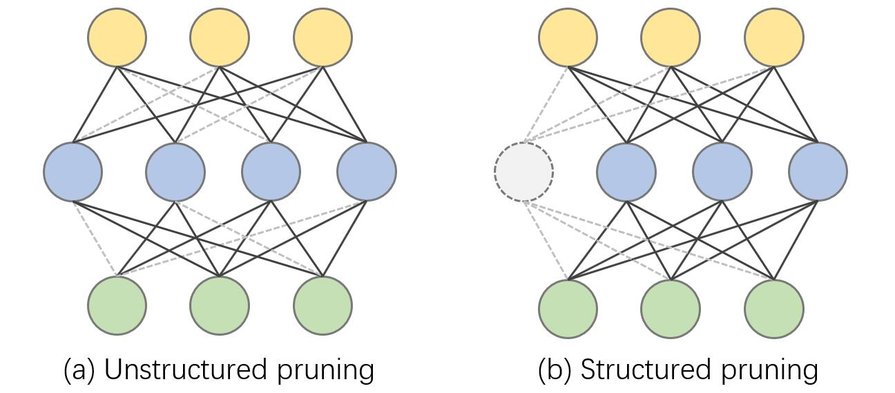

Hi there! I'm Gongfan Fang, a final-year M.Sc student at Zhejiang University supervised by <a href="https://person.zju.edu.cn/en/msong">Professor Mingli Song</a>. I received my Bachelor’s degree of Computer Science at Zhejiang University in 2019. My research interests include model compression, computer vision and efficient training. Now, I'm also working closely with <a href="https://vipazoo.cn/people/songjie">Dr. Jie Song (Zhejiang University)</a>, <a href="https://sites.google.com/site/sitexinchaowang/">Dr. Xinchao Wang (National University of Singapore)</a> and <a href="https://chengchaoshen.github.io/">Dr. Chengchao Shen (Central South University)</a>. 

<h2> Research </h2>

    <dl class="description">
        
</img>

        <dt class="ptitle">Up to 100× Faster Data-free Knowledge Distillation</dt>
        <dd><b>Gongfan Fang*</b>, Kanya Mo*, Xinchao Wang, Jie Song, Shitao Bei, Haofei Zhang, Mingli Song  </dd>
        <dd>Thirty-Sixth AAAI Conference on Artificial Intelligence (AAAI-22)</dd>
        <dd>
            [<a href="https://www.aaai.org/AAAI22Papers/AAAI-66.FangG.pdf" target="_blank">paper</a>]
            [<a href="https://arxiv.org/abs/2112.06253" target="_blank">arXiv</a>]
            [<a href="https://github.com/zju-vipa/Fast-Datafree" target="_blank">code</a>]
            
[<a class="fakelink" onclick="$(this).siblings('.bibref').slideToggle()">bibtex</a>]
                

@misc{fang2022100times,
      title={Up to 100$\times$ Faster Data-free Knowledge Distillation}, 
      author={Gongfan Fang and Kanya Mo and Xinchao Wang and Jie Song and Shitao Bei and Haofei Zhang and Mingli Song},
      year={2022},
      eprint={2112.06253},
      archivePrefix={arXiv},
      primaryClass={cs.LG}
}

            
  
            
[<a class="fakelink" onclick="$(this).siblings('.abstract').slideToggle()">abstract</a>]
                
  
                    
Data-free knowledge distillation (DFKD) has recently been attracting increasing attention from research communities, attributed to its capability of compressing a model only using synthetic data. Despite the encouraging results achieved, state-of-the-art DFKD methods still suffer from the inefficiency of data synthesis, making the data-free training process extremely time-consuming and thus inapplicable for large-scale tasks. In this work, we introduce an efficacious scheme, termed as FastDFKD, that allows us to accelerate DFKD by a factor of orders of magnitude. At the heart of our approach is a novel strategy to reuse the shared common features in training data so as to synthesize different data instances. Unlike prior methods that optimize a set of data independently, we propose to learn a meta-synthesizer that seeks common features as the initialization for the fast data synthesis. As a result, FastDFKD achieves data synthesis within only a few steps,  significantly enhancing the efficiency of data-free training. Experiments over CIFAR, NYUv2 and ImageNet demonstrate that the proposed FastDFKD achieves 10$\times$ and even 100$\times$ acceleration while preserving  performances on par with the state of the art. 

                

            
       
        </dd>
    </dl>

    <dl class="description">
        
</img>

        <dt class="ptitle">Mosaicking to Distill: Knowledge Distillation from Out-of-Domain Data</dt>
        <dd><b>Gongfan Fang</b>, Yifan Bao, Jie Song, Xinchao Wang, Donglin Xie, Chengchao Shen, Mingli Song</dd>
        <dd>Thirty-fifth Conference on Neural Information Processing Systems (NeurIPS-21)</dd>
        <dd>
            [<a href="https://papers.nips.cc/paper/2021/file/63dc7ed1010d3c3b8269faf0ba7491d4-Paper.pdf" target="_blank">paper</a>]
            [<a href="https://arxiv.org/abs/2110.15094" target="_blank">arXiv</a>]
            [<a href="https://github.com/zju-vipa/MosaicKD" target="_blank">code</a>]
            
[<a class="fakelink" onclick="$(this).siblings('.bibref').slideToggle()">bibtex</a>]
                

@inproceedings{fang2021mosaicking,
    title={Mosaicking to Distill: Knowledge Distillation from Out-of-Domain Data},
    author={Fang, Gongfan and Bao, Yifan and Song, Jie and Wang, Xinchao and Xie, Donglin and Shen, Chengchao and Song, Mingli},
    booktitle={Thirty-Fifth Conference on Neural Information Processing Systems},
    year={2021}
}
            

            
  
            
[<a class="fakelink" onclick="$(this).siblings('.abstract').slideToggle()">abstract</a>]
                
  
                    
Knowledge distillation (KD) aims to craft a compact student model that imitates the behavior of a pre-trained teacher in a target domain. Prior KD approaches, despite their gratifying results, have largely relied on the premise that in-domain data is available to carry out the knowledge transfer. Such an assumption, unfortunately, in many cases violates the practical setting, since the original training data or even the data domain is often unreachable due to privacy or copyright reasons. In this paper, we attempt to tackle an ambitious task, termed as out-of-domain knowledge distillation (OOD-KD), which allows us to conduct KD using only OOD data that can be readily obtained at a very low cost. Admittedly, OOD-KD is by nature a highly challenging task due to the agnostic domain gap. To this end, we introduce a handy yet surprisingly efficacious approach, dubbed as MosaicKD. The key insight behind MosaicKD lies in that, samples from various domains share common local patterns, even though their global semantic may vary significantly; these shared local patterns, in turn, can be re-assembled analogous to mosaic tiling, to approximate the in-domain data and to further alleviating the domain discrepancy. In MosaicKD, this is achieved through a four-player min-max game, in which a generator, a discriminator, a student network, are collectively trained in an adversarial manner, partially under the guidance of a pre-trained teacher. We validate MosaicKD over classification and semantic segmentation tasks across various benchmarks, and demonstrate that it yields results much superior to the state-of-the-art counterparts on OOD data. 

                

            
       
        </dd>
    </dl>

    <dl class="description">
        
</img>

        <dt class="ptitle">Contrastive Model Inversion for Data-Free Knowledge Distillation</dt>
        <dd><b>Gongfan Fang</b>, Jie Song, Xinchao Wang, Chengchao Shen, Xingen Wang, Mingli Song</dd>
        <dd>International Joint Conferences on Artificial Intelligence Organization (IJCAI-21)</dd>
        <dd>
            [<a href="https://www.ijcai.org/proceedings/2021/0327.pdf" target="_blank">paper</a>]
            [<a href="https://arxiv.org/abs/2105.08584" target="_blank">arXiv</a>]
            [<a href="https://github.com/zju-vipa/DataFree" target="_blank">code</a>]
            
[<a class="fakelink" onclick="$(this).siblings('.bibref').slideToggle()">bibtex</a>]
                

@inproceedings{fang2021contrastive,
    title={Contrastive Model Inversion for Data-Free Knowledge Distillation},
    author={Fang, Gongfan and Song, Jie and Wang, Xinchao and Shen, Chengchao and Wang, Xingen and Song, Mingli},
    booktitle={Proceedings of the Thirtieth International Joint Conference on Artificial Intelligence (IJCAI-21)},
    year={2021}
}
            

            
  
            
[<a class="fakelink" onclick="$(this).siblings('.abstract').slideToggle()">abstract</a>]
                
  
                    
Model inversion, whose goal is to recover training data from a pre-trained model, has been recently proved feasible. However, existing inversion methods usually suffer from the mode collapse problem, where the synthesized instances are highly similar to each other and thus show limited effectiveness for downstream tasks, such as knowledge distillation. In this paper, we propose Contrastive Model Inversion~(CMI), where the data diversity is explicitly modeled as an optimizable objective, to alleviate the mode collapse issue. Our main observation is that, under the constraint of the same amount of data, higher data diversity usually indicates stronger instance discrimination. To this end, we introduce in CMI a contrastive learning objective that encourages the synthesizing instances to be distinguishable from the already synthesized ones in previous batches. Experiments of pre-trained models on CIFAR-10, CIFAR-100, and Tiny-ImageNet demonstrate that CMI not only generates more visually plausible instances than the state of the arts, but also achieves significantly superior performance when the generated data are used for knowledge distillation. 

                

            
       
        </dd>
    </dl>

    <dl class="description">
        
</img>

        <dt class="ptitle">Data-Free Adversarial Distillation</dt>
        <dd><b>Gongfan Fang</b>, Jie Song, Chengchao Shen, Xinchao Wang, Da Chen, Mingli Song</dd>
        <dd>arXiv preprint arXiv:1912.11006</dd>
        <dd>
            [<a href="https://arxiv.org/abs/1912.11006" target="_blank">arXiv</a>]
            [<a href="https://github.com/VainF/Data-Free-Adversarial-Distillation" target="_blank">code</a>]
            
[<a class="fakelink" onclick="$(this).siblings('.bibref').slideToggle()">bibtex</a>]
                

@article{fang2019data,
    title={Data-free adversarial distillation},
    author={Fang, Gongfan and Song, Jie and Shen, Chengchao and Wang, Xinchao and Chen, Da and Song, Mingli},
    journal={arXiv preprint arXiv:1912.11006},
    year={2019}
}
            

            
  
            
[<a class="fakelink" onclick="$(this).siblings('.abstract').slideToggle()">abstract</a>]
                
  
                    
Knowledge Distillation (KD) has made remarkable progress in the last few years and become a popular paradigm for model compression and knowledge transfer. However, almost all existing KD algorithms are data-driven, i.e., relying on a large amount of original training data or alternative data, which is usually unavailable in real-world scenarios. In this paper, we devote ourselves to this challenging problem and propose a novel adversarial distillation mechanism to craft a compact student model without any real-world data. We introduce a model discrepancy to quantificationally measure the difference between student and teacher models and construct an optimizable upper bound. In our work, the student and the teacher jointly act the role of the discriminator to reduce this discrepancy, when a generator adversarially produces some "hard samples" to enlarge it. Extensive experiments demonstrate that the proposed data-free method yields comparable performance to existing data-driven methods. More strikingly, our approach can be directly extended to semantic segmentation, which is more complicated than classification, and our approach achieves state-of-the-art results. 

                

            
       
        </dd>
    </dl>

    <dl class="description">
        
</img>

        <dt class="ptitle">Knowledge amalgamation from heterogeneous networks by common feature learning</dt>
        <dd>Sihui Luo, Xinchao Wang, <b>Gongfan Fang</b>, Yao Hu, Dapeng Tao, Mingli Song</dd>
        <dd>International Joint Conferences on Artificial Intelligence Organization (IJCAI-19)</dd>
        <dd>
            [<a href="https://www.ijcai.org/proceedings/2019/0428.pdf" target="_blank">paper</a>]
            [<a href="https://arxiv.org/abs/1906.10546" target="_blank">arXiv</a>]
            [<a href="https://github.com/zju-vipa/CommonFeatureLearning" target="_blank">code</a>]
            
[<a class="fakelink" onclick="$(this).siblings('.bibref').slideToggle()">bibtex</a>]
                

@inproceedings{luo2019knowledge,
    title={Knowledge Amalgamation from Heterogeneous Networks by Common Feature Learning},
    author={Luo, Sihui and Wang, Xinchao and Fang, Gongfan and Hu, Yao and Tao, Dapeng and Song, Mingli},
    booktitle={Proceedings of the 28th International Joint Conference on Artificial Intelligence (IJCAI)},
    year={2019},
}
            

            
  
            
[<a class="fakelink" onclick="$(this).siblings('.abstract').slideToggle()">abstract</a>]
                
  
                    
An increasing number of well-trained deep networks have been released online by researchers and developers, enabling the community to reuse them in a plug-and-play way without accessing the training annotations. However, due to the large number of network variants, such public-available trained models are often of different architectures, each of which being tailored for a specific task or dataset. In this paper, we study a deep-model reusing task, where we are given as input pre-trained networks of heterogeneous architectures specializing in distinct tasks, as teacher models. We aim to learn a multitalented and light-weight student model that is able to grasp the integrated knowledge from all such heterogeneous-structure teachers, again without accessing any human annotation. To this end, we propose a common feature learning scheme, in which the features of all teachers are transformed into a common space and the student is enforced to imitate them all so as to amalgamate the intact knowledge. We test the proposed approach on a list of benchmarks and demonstrate that the learned student is able to achieve very promising performance, superior to those of the teachers in their specialized tasks. 

                

            
       
        </dd>
    </dl>

    <dl class="description">
        
</img>

        <dt class="ptitle">Adversarial Self-Supervised Data-Free Distillation for Text Classification</dt>
        <dd>Xinyin Ma, Yongliang Shen, <b>Gongfan Fang</b>, Chen Chen, Chenghao Jia, Weiming Lu/dd>
        <dd>Empirical Methods in Natural Language Processing (EMNLP-20)</dd>
        <dd>
            [<a href="https://www.aclweb.org/anthology/2020.emnlp-main.499.pdf" target="_blank">paper</a>]
            [<a href="https://arxiv.org/abs/2010.04883" target="_blank">arXiv</a>]
            
[<a class="fakelink" onclick="$(this).siblings('.bibref').slideToggle()">bibtex</a>]
                

@inproceedings{ma2020adversarial,
    title={Adversarial Self-Supervised Data Free Distillation for Text Classification},
    author={Ma, Xinyin and Shen, Yongliang and Fang, Gongfan and Chen, Chen and Jia, Chenghao and Lu, Weiming},
    booktitle={Proceedings of the 2020 Conference on Empirical Methods in Natural Language Processing (EMNLP)},
    pages={6182--6192},
    year={2020}
}
            

            
  
            
[<a class="fakelink" onclick="$(this).siblings('.abstract').slideToggle()">abstract</a>]
                
  
                    
Large pre-trained transformer-based language models have achieved impressive results on a wide range of NLP tasks. In the past few years, Knowledge Distillation(KD) has become a popular paradigm to compress a computationally expensive model to a resource-efficient lightweight model. However, most KD algorithms, especially in NLP, rely on the accessibility of the original training dataset, which may be unavailable due to privacy issues. To tackle this problem, we propose a novel two-stage data-free distillation method, named Adversarial self-Supervised Data-Free Distillation (AS-DFD), which is designed for compressing large-scale transformer-based models (e.g., BERT). To avoid text generation in discrete space, we introduce a Plug & Play Embedding Guessing method to craft pseudo embeddings from the teacher's hidden knowledge. Meanwhile, with a self-supervised module to quantify the student's ability, we adapt the difficulty of pseudo embeddings in an adversarial training manner. To the best of our knowledge, our framework is the first data-free distillation framework designed for NLP tasks. We verify the effectiveness of our method on several text classification datasets. 

                

            
       
        </dd>
    </dl>

  

<h2> Project </h2>

</img>

    <dl class="description">
        
</img>

        <dt class="ptitle">Pytorch-MSSSIM</dt>
        <dd>Fast and differentiable MS-SSIM and SSIM for pytorch</dd>
        <dd><a href="https://github.com/VainF/pytorch-msssim" target="_blank">https://github.com/VainF/pytorch-msssim</a></dd>
    </dl>

    <dl class="description">
        
</img>

        <dt class="ptitle">Torch-Pruning</dt>
        <dd>A pytorch toolkit for structured neural network pruning and layer dependency maintaining</dd>
        <dd><a href="https://github.com/VainF/Torch-Pruning" target="_blank">https://github.com/VainF/Torch-Pruning</a></dd>
    </dl>

    <dl class="description">
        
</img>

        <dt class="ptitle">DeepLabV3Plus-Pytorch</dt>
        <dd>DeepLabv3, DeepLabv3+ and pretrained weights on VOC & Cityscapes.</dd>
        <dd><a href="https://github.com/VainF/DeepLabV3Plus-Pytorch" target="_blank">https://github.com/VainF/DeepLabV3Plus-Pytorch</a></dd>

    </dl>

 

<h2> Education </h2>

<b>2019.06 - present</b> - M.Sc Student, Zhejiang Univeristy.  
<b>2015.09 - 2019.06</b> - Undergraduate Student, Zhejiang Univeristy.
